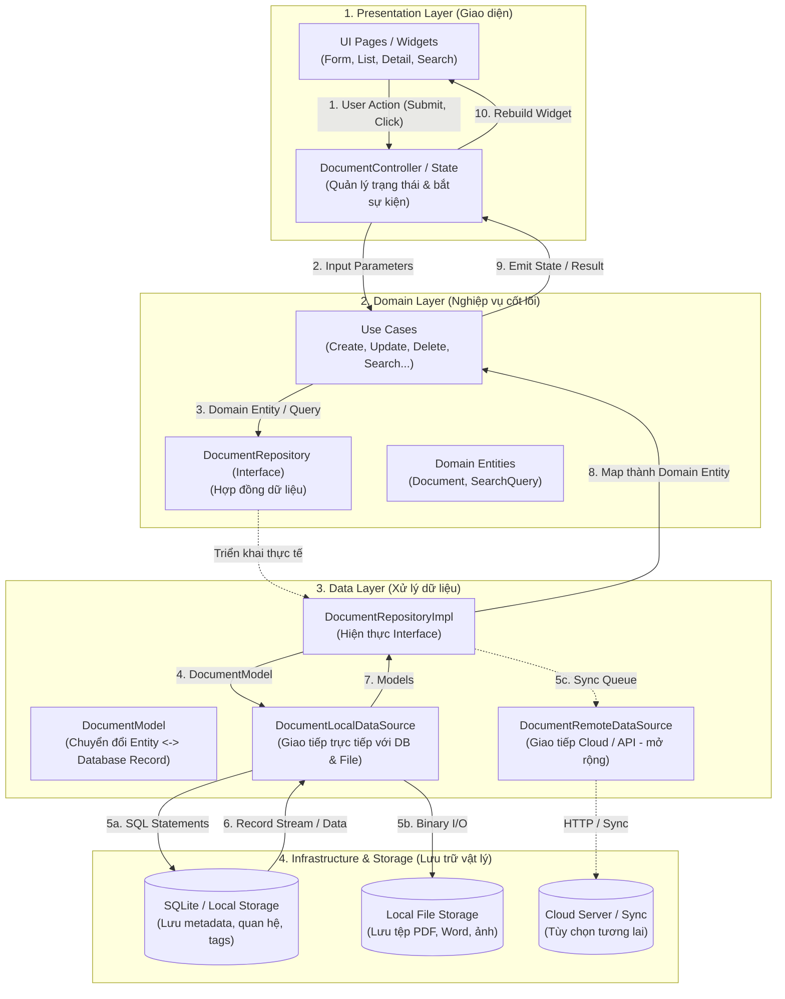
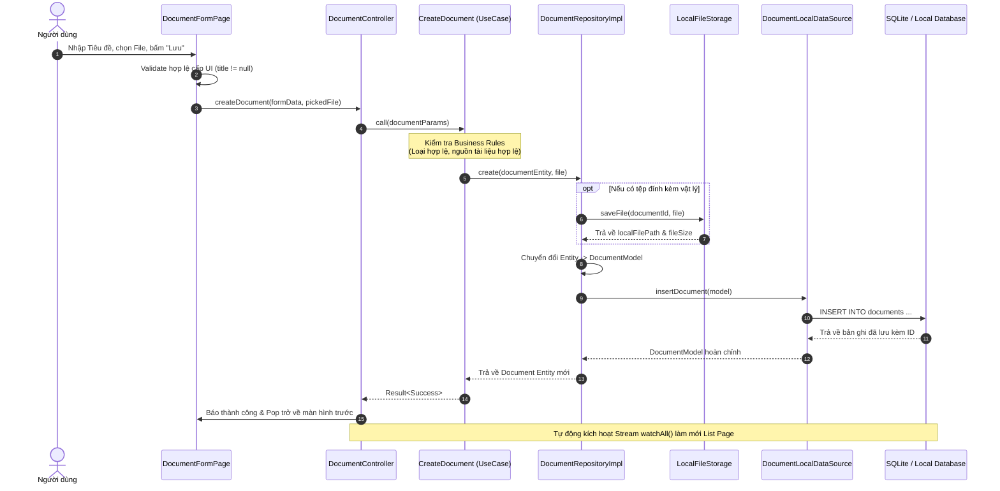
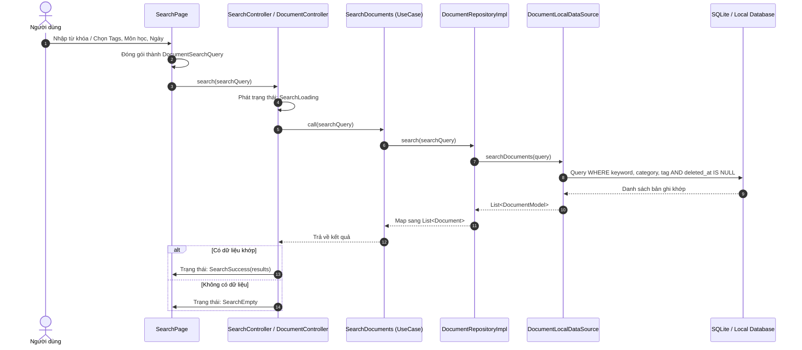
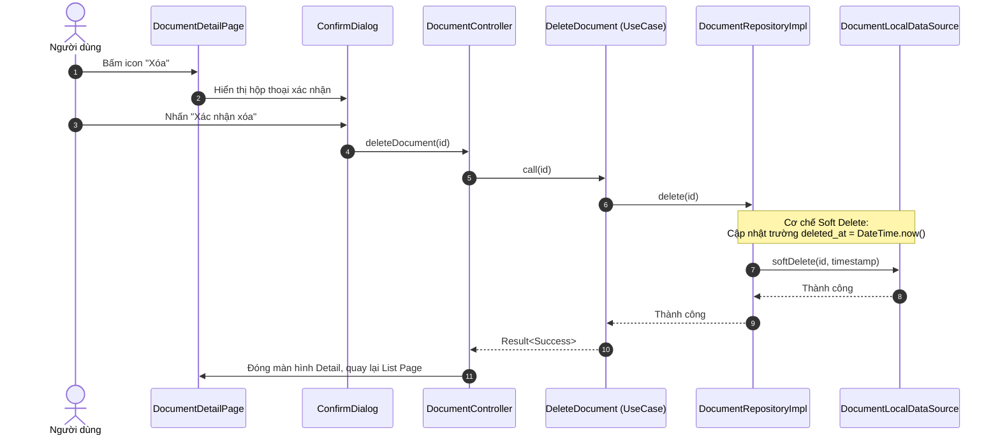

# Quản lý Tài liệu Học tập (Learning Document Management)

Ứng dụng Flutter **Local-first**, **Modular** và **File-oriented** hỗ trợ người học tổ chức, lưu trữ, tra cứu và tìm kiếm tài liệu học tập một cách khoa học, hiệu quả. 

Kiến trúc dự án được thiết kế theo nguyên tắc **Feature-first** kết hợp **Clean Architecture** (Presentation ➔ Domain ➔ Data ➔ Infrastructure), phân tách ranh giới rõ ràng, dễ bảo trì và sẵn sàng mở rộng các tính năng nâng cao (Sync Cloud, OCR, Semantic Search).

---

## 1. Yêu cầu chức năng (Functional Requirements)

### 1.1. Phân hệ Quản lý Tài liệu (Core Documents Management)
Đây là nghiệp vụ trung tâm của ứng dụng:
- **Thêm mới tài liệu (Create):**
  - Thông tin bắt buộc: Tiêu đề (*Title*), Loại tài liệu (*Document Type: lecture, assignment, reference, exam, note, other*), Nguồn tài liệu (File đính kèm hoặc External URL).
  - Thông tin mở rộng: Tác giả (*Author*), Mô tả (*Description*), Môn học (*Category/Subject*), Danh sách nhãn dán (*Tags*).
- **Xem danh sách tài liệu (Read / List):**
  - Hiển thị danh sách tài liệu dạng Card/List kèm thông tin trực quan.
  - Tự động cập nhật theo thời gian thực (Reactive stream từ local database).
  - Sắp xếp linh hoạt theo thời gian tạo, cập nhật hoặc tên tài liệu.
- **Xem chi tiết tài liệu (Detail View):**
  - Hiển thị toàn diện metadata của tài liệu.
  - Hỗ trợ thao tác mở tệp tin đính kèm cục bộ (PDF, Word, hình ảnh...) hoặc mở liên kết bên ngoài (Google Drive, Web URL).
- **Chỉnh sửa tài liệu (Update):**
  - Cập nhật tiêu đề, mô tả, môn học, tác giả, tệp/URL và danh sách tags.
  - Tự động cập nhật mốc thời gian `updated_at`.
- **Xóa tài liệu (Delete):**
  - Hộp thoại cảnh báo xác nhận trước khi xóa.
  - Áp dụng cơ chế **Soft Delete** (`deleted_at`) giúp hỗ trợ khôi phục (Trash/Undo) và xử lý xung đột đồng bộ khi kết nối Cloud.

### 1.2. Phân hệ Phân loại & Danh mục (Categories / Subjects)
- Quản lý danh sách môn học/chủ đề học tập.
- Thiết lập quan hệ `1 Category - N Documents`, giúp phân loại tài liệu theo từng học phần, kỳ học.

### 1.3. Phân hệ Gắn nhãn (Tags Management)
- Quản lý nhãn dán linh hoạt theo nhu cầu người học (ví dụ: `#slide`, `#de-thi-2024`, `#lab`, `#on-tap`).
- Thiết lập quan hệ `N Documents - N Tags`, hỗ trợ phân loại đa chiều và tìm kiếm nhanh.

### 1.4. Phân hệ Tìm kiếm & Lọc (Search & Filtering)
Phân hệ độc lập giao tiếp qua đối tượng truy vấn `DocumentSearchQuery`:
- **Tìm kiếm theo từ khóa:** Khớp từ khóa trên Tiêu đề (*Title*), Mô tả (*Description*) và Tác giả (*Author*).
- **Bộ lọc đa tiêu chí (Multi-criteria Filter):**
  - Lọc theo Môn học (`categoryId`).
  - Lọc theo Loại tài liệu (`type`).
  - Lọc theo một hoặc nhiều Nhãn (`tagIds`).
  - Lọc theo khoảng ngày tạo / chỉnh sửa (`from` -> `to`).
- **Định hướng nâng cấp:** Giai đoạn sau hỗ trợ SQLite FTS5 (Full-Text Search) và Semantic Search (Vector Embeddings).

### 1.5. Phân hệ Quản lý Tệp tin (File Storage)
- Tách biệt hoàn toàn metadata và file vật lý: Cơ sở dữ liệu chỉ lưu đường dẫn (`file_path`), định dạng (`mime_type`), dung lượng (`file_size`).
- File vật lý được lưu trữ riêng biệt trong thư mục cục bộ của ứng dụng (`core/storage`).

### 1.6. Phân hệ Mở rộng (Future Modules)
- **Xử lý tài liệu (`document_processing`):** Trích xuất văn bản (OCR), sinh ảnh đại diện (thumbnail trang đầu PDF), đánh chỉ mục nội dung.
- **Đồng bộ đám mây (`sync`):** Lưu trữ hàng đợi đồng bộ (*Sync Queue*), tự động đồng bộ hai chiều với Cloud khi có kết nối mạng theo mô hình Local-first.

---

### Bảng ma trận chức năng (Feature Matrix)

| Phân hệ | Phiên bản MVP | Phiên bản nâng cao |
| :--- | :--- | :--- |
| **Documents** | Thêm, xem danh sách, xem chi tiết, sửa, xóa (soft delete) | Xem trước file (in-app preview), khôi phục từ thùng rác |
| **Categories** | Chọn môn học cho tài liệu, lọc theo môn | Quản lý cây danh mục phân cấp đa tầng (Parent - Child) |
| **Tags** | Gán tags cho tài liệu, tìm tài liệu theo tag | Gợi ý tag thông minh, quản lý màu sắc tag |
| **Search** | Tìm theo từ khóa + Lọc theo Type/Category/Tag/Ngày | SQLite FTS5, Semantic Search với Embeddings |
| **Storage** | Lưu file đính kèm vào local storage | Nén file, trích xuất text/OCR, backup cloud |

---

## 2. Thiết kế Sơ đồ Luồng dữ liệu (Data Flow Diagrams)

### 2.1. Sơ đồ kiến trúc luồng dữ liệu tổng quát (Layered DFD)

Luồng dữ liệu di chuyển một chiều từ Presentation qua Domain tới Data Layer và lưu trữ, sau đó phản hồi ngược lại UI thông qua cơ chế Reactive Stream:



---

### 2.2. Luồng nghiệp vụ Thêm mới tài liệu (Create Document Flow)



---

### 2.3. Luồng Đọc danh sách phản ứng (Reactive Watch Flow)

Hệ thống hoạt động theo triết lý **Local-first**, danh sách luôn lắng nghe sự kiện thay đổi từ cơ sở dữ liệu qua luồng Stream:

```mermaid
flowchart LR
    A[("Local Database: documents")] -->|"watchAll() Stream"| B["DocumentLocalDataSource"]
    B -->|"Stream&lt;List&lt;DocumentModel&gt;&gt;"| C["DocumentRepositoryImpl"]
    C -->|"Map sang Stream&lt;List&lt;Document&gt;&gt;"| D["WatchDocuments / ListDocuments"]
    D -->|"Stream State"| E["DocumentController"]
    E -->|"StreamBuilder / Reactive State"| F["DocumentListPage (UI)"]

    style A fill:#e1f5fe,stroke:#0288d1
    style F fill:#e8f5e9,stroke:#388e3c
```



* **Lợi ích:** Mọi thao tác Thêm, Sửa, Xóa ở bất kỳ màn hình nào đều tự động kích hoạt Stream cập nhật lại giao diện danh sách ngay lập tức mà không cần gọi hàm reload thủ công.

---

### 2.4. Luồng Tìm kiếm & Lọc (Search & Filter Flow)



---

### 2.5. Luồng Xóa tài liệu (Soft Delete Flow)



---

## 3. Cấu trúc thư mục chuẩn

```text
lib/
├── app/                 # Cấu hình cấp ứng dụng (app.dart, routing, theme, config)
│   ├── router/
│   ├── theme/
│   └── config/
├── core/                # Hạ tầng dùng chung (database, storage, error, logging, widgets)
│   ├── database/        # Drift/SQLite tables, migrations, provider
│   ├── storage/         # Local file storage abstraction
│   ├── search/          # DocumentSearchQuery & SearchIndex
│   ├── errors/          # AppException, Failure
│   ├── widgets/         # Generic widgets (AppButton, AppTextField, LoadingView...)
│   └── utils/           # DateUtils, FileUtils, ValidationUtils
├── features/            # Feature-first modules
│   ├── documents/       # Nghiệp vụ tài liệu cốt lõi
│   │   ├── data/        # DataSources, Models, RepositoryImpl
│   │   ├── domain/      # Entities, Repository Interfaces, UseCases
│   │   └── presentation/# Pages, Widgets, Controllers
│   ├── categories/      # Nghiệp vụ môn học / danh mục
│   ├── tags/            # Nghiệp vụ nhãn dán
│   └── search/          # Giao diện và nghiệp vụ tìm kiếm nâng cao
└── shared/              # Hằng số và extension dùng chung
```

---

## 4. Hướng dẫn chạy và kiểm thử

### Yêu cầu môi trường
- Đã cài đặt Flutter SDK (khuyến nghị phiên bản 3.x trở lên).

### Cài đặt dependencies
```sh
flutter pub get
```

### Chạy ứng dụng
- Chạy trên trình duyệt Chrome:
  ```sh
  flutter run -d chrome
  ```
- Hoặc chạy trên thiết bị di động/máy ảo:
  ```sh
  flutter run
  ```

### Kiểm tra chất lượng mã nguồn & Kiểm thử
```sh
flutter analyze
flutter test
```
